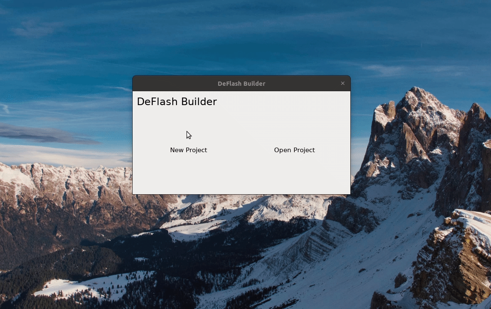

# DeFlash Builder

DeFlash is a simple program you can use to make animations and (at some point in the future)
games. It is heavily inspired by Flash Builder, but tries to do away with the bloat and other
unpleasantries of Flash.

It is cross platform, and should work the same on OS-X, Linux, and Windows.

## Building

You need Qt, CMake, some CMake backend (like make or visual studio), and ffmpeg installed.
Run the usual commands to compile.
